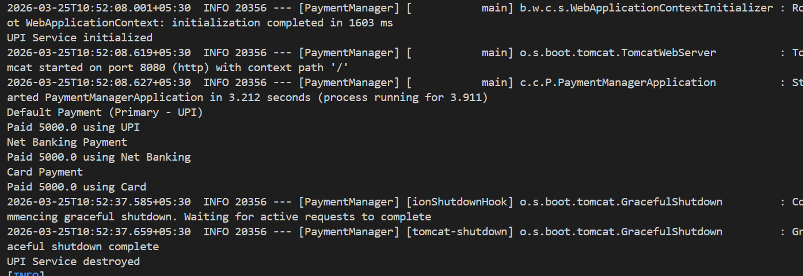

# 💳 Payment Manager Application (Spring Boot)

A Spring Boot application demonstrating Dependency Injection and Bean Lifecycle concepts using multiple payment methods.

---

## Features

* Multiple payment methods:

  * UPI (default using `@Primary`)
  * Net Banking (using `@Qualifier`)
  * Cards (lazy initialized using `@Lazy`)
* Centralized payment handling via `PaymentManager`
* REST API endpoint to trigger payments
* External configuration using `application.properties`
* Bean lifecycle tracking using `@PostConstruct` and `@PreDestroy`

---

## Configuration

**application.properties**
add this:
```
payment.amount=5000
```

---

## How to Run

```bash
mvn clean spring-boot:run
```

---

## API Endpoint

```
GET http://localhost:8080/pay
```

### Response:

```
Payment Done!
```

### Console Output:


---
### Bean Lifecycle Behavior
* UPIService initializes at application startup (@PostConstruct)
* CardsService is lazily initialized only when invoked (@Lazy)
* UPIService cleanup runs on application shutdown (@PreDestroy)
---

## Tech Stack

* Java 17+
* Spring Boot
* Maven